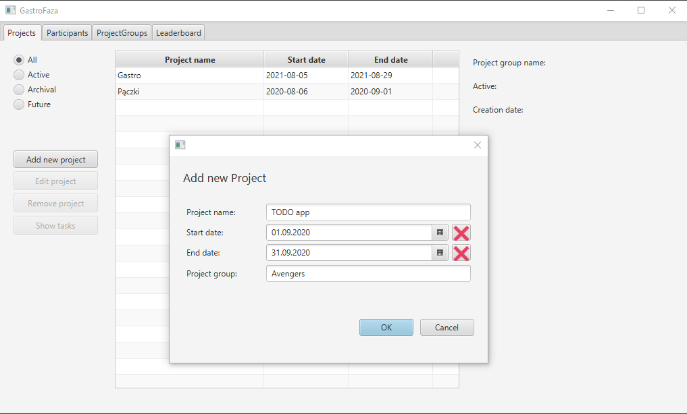
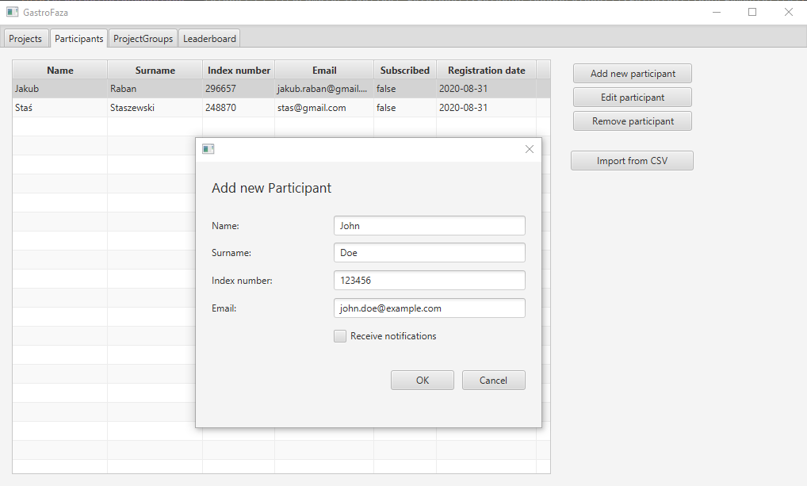
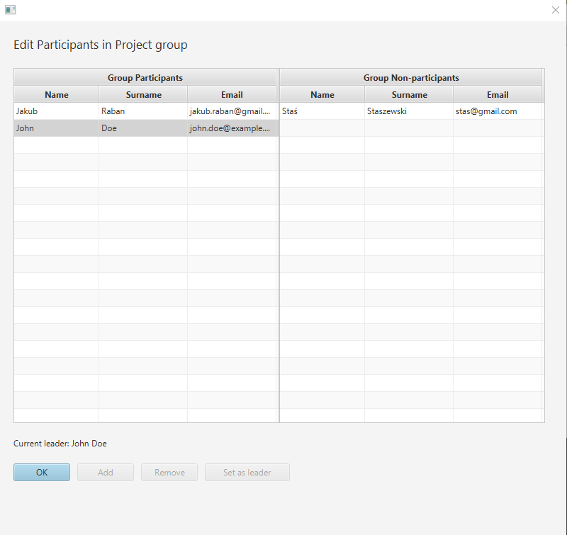
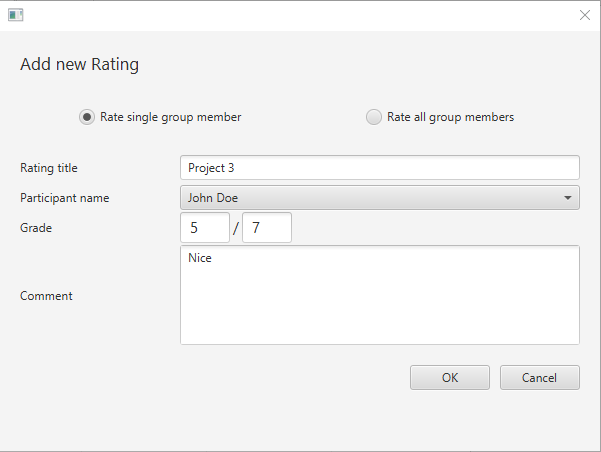
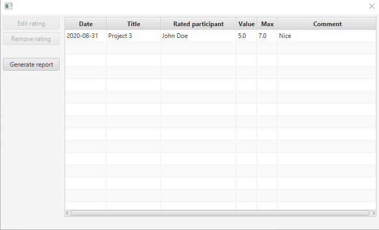
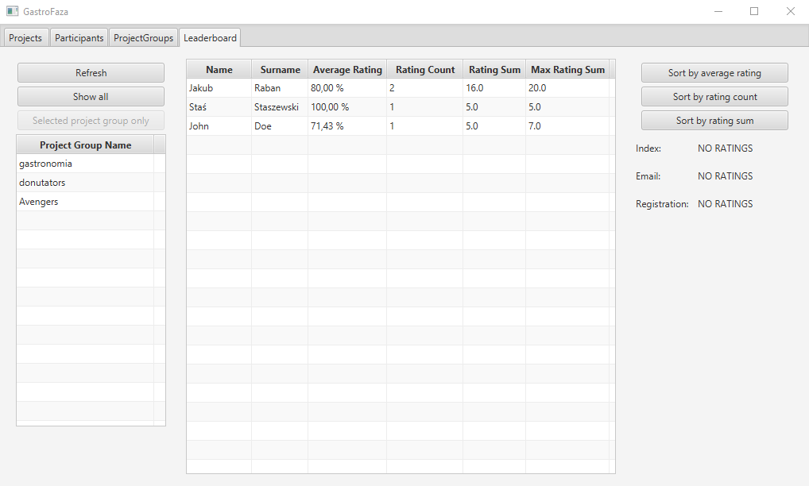

# Project Manager
A JavaFX application made for teachers who want to have control over the projects they supervise. Allows creating projects, assigning students to those groups and giving them ratings. Those ratings are later presented in a form of leaderboard which can be exported to a text file.

## Tech stack
- Java 11
- JavaFX (for window GUI and MVC model)
- Hibernate
- SQL database (MySQL was used)

## How it works
- Teacher creates new project and assigns start and end dates. A project group is automatically created

- Teacher adds any number of participants and assigns them to a specific project (one participant can take part in many projects)

- Participants who are assigned to a project can be given ratings. Teacher can rate a single member or bulk rate every member. 

- Every group's ratings can be later seen and exported to a text file. Each participant's combined rating can be seen in a leaderboard

## Internals
- Project uses Hibernate which maps Java objects to relational database entities. Because JavaFX is used, the fields are actually of JavaFX Property type, and values returned by getters are mapped to database fields
- Data Access Objects (DAO) are used to perform database queries. Those are written in HQL (Hibernate Query Language)
